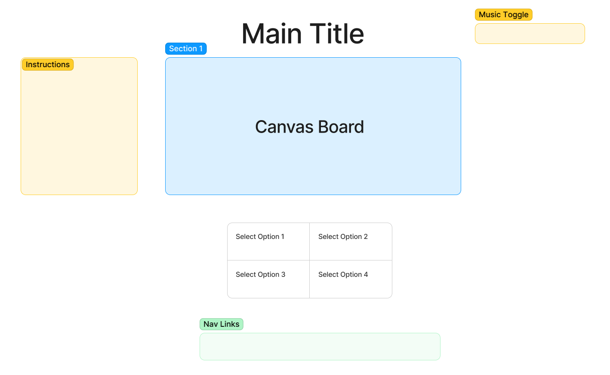

# PokeGuess: Guessing Game

Check out the [Live Site!](https://ertan96.github.io/PokeGuess/)

# Background
PokeGuess is a simple game where a user will be given a multiple choice of images to select. There will be the same amount of silhouette of those images on a canvas floating around; minus one image. These silhouettes overlap each other to make it more difficult for the player to identify what images are on the canvas.

The Rules are simple:
- The player must select all the correct images to complete a round.
- A player will have one chance to select all the correct images within a given time frame or else you lose.
- When you beat all the rounds you win!

If time persist, there will be several levels of difficulty a player can select from where the movement of the silhouettes are faster and the image outlines will have minimal differences. 

# Functionality & MVPs
In Silhouette, users will be able to:

- Start the game to have silhoettes floating on the canvas
- Select from a limited amount of options/buttons to select the correct silhouette
- Pause button to pause/unpause the background music at anytime
- Overlapping silhouettes of objects floating around the canvas

In addition, this project will include:

- A description of rules for the game
- A production README

# Wireframes

- Nav links include links to this project's Github repo and my LinkedIn.
- Game controls will be to click on the buttons on the screen.
- On the top right, there will be a clickable music toggle for on/off.
- On the left, there will be instructions on the screen at all times while playing.
- Additionally, there will be 3 levels to choose from for the level of difficulty (Bonus).

# Technologies, Libraries, APIs
This project will be implemented with the following technologies:

 - The Canvas API to render the view board
 - Webpack and Babel to bundle and transpile the source JavaScript code
 - npm to manage project dependencies

# Implementation Timeline
NB:

- Friday Afternoon & Weekend: Setup project, including getting webpack up and running. Get canvas to show up on the screen, and spend time getting comfortable with the Canvas API. Create Board option grid selector classes. Get a grid rendered to the canvas reflecting the initial framework of the project.

- Monday: Dedicate this day toward implementing the underlying logic of Silhouette. Ensure that I can get floating objects moving around the view board. Also able to generate the same objects in my options board. If extra time, make sure this is all rendered correctly on the canvas.

- Tuesday: Focus on player control clicks. Clicking the correct option renders the silhouette back to the original image. Making sure Game logic is complete with a win/lose screen popup. As well as popup of current round before each round starts. Clock countdown for time left in the round.

- Wednesday: Finish implementing user controls, and focus on styling, as well as implementing the different color schemes and nav links. If extra time, start on bonuses.

- Thursday Morning: Deploy to GitHub pages. If time, rewrite this proposal as a production README.

# Bonus features
There are many add-ons to make this game more advanced:

- Add difficulty levels to select from
- Different sound effects for button clicks while an existing background music is playing
